# Nowcast

  __Contents:__\
    Purpose\
    Data and processing\
    Testing\
    Models\
    Ensemble\
    Results\
    Future improvement

## Purpose
The purpose of this project is to nowcast low-frequency macroeconomic variable with high frequency data. The specific variable examined is quarterly GDP, but the methodology should be applicable to any other low-frequency measures. The predictors are a mixture of daily, monthly, and quarterly variables. Predictions are made on a monthly basis, as many readily available packages deal with monthly-quarterly mixed frequency data with ease. Extension to daily prediction is straightforward for most models (MIDAS/LSTM/elastic-net) but requires some work for DFM MQ. However, as per Bańbura, Marta, and Michele Modugno (2014), we know that the latent variable treatment can theoretically deal with any pattern of missing data at any frequency. Thus, an extension to daily frequency would require some extra work based on the Statsmodels package. The project conducts both seasonal and desonalized analysis with the same structure. In the end, the individual models are stacked for better predictive performance and compared against an ARIMA/SARIMA model as per the literature.

## Contribution
The seasonal ensemble outperforms the baseline by **41.96%%** in terms of RMSE. The deseasonalized ensemble outperforms the baseline by **77.64%** in terms of RMSE. 

### Summary Table of Results

| **Method**                | **Vintage 0** | **Vintage 1** | **Vintage 2** | **Vintage 3** | **Overall RMSE** |
|---------------------------|---------------|---------------|---------------|---------------|------------------|
| ARIMA                     |               |               |               |               | 0.7126           |
| SARIMA                    |               |               |               |               | 0.6602           |
| DFM_MQ                    | 0.8331        | 0.7422        | 0.8453        | 1.0216        | 0.8610           |
| MIDAS                     | 0.5509        | 0.5745        | 0.5920        | 0.5945        | 0.5780           |
| LSTM                      | 0.5022        | 0.6404        | 0.8696        | 0.9799        | 0.7480           |
| Elastic-net               | 0.3651        | 0.3650        | 0.3647        | 0.4270        | 0.3805           |
| Ensemble                  | 0.5354        | 0.3259        | 0.3288        | 0.4641        | 0.4136           |
| ARIMA (Deseasonalized)     |               |               |               |               | 1.5873          |
| SARIMA (Deseasonalized)    |               |               |               |               | 1.7877          |
| DFM_MQ (Deseasonalized)    | 1.0509        | 1.1909        | 1.1478        | 1.2942        | 1.1710          |
| MIDAS (Deseasonalized)     | 1.0972        | 1.1111        | 1.1835        | 1.1832        | 1.1438          |
| LSTM (Deseasonalized)      | 1.2152        | 1.2620        | 1.2333        | 1.2447        | 1.2388          |
| Elastic-net (Deseasonalized)| 0.9895       | 0.9924        | 1.0463        | 1.0446        | 1.0182          |
| Ensemble (Deseasonalized)  | 0.2319        | 0.3453        | 0.4157        | 0.4256        | 0.3546          |


## Data and processing
### Data source
In the illustrations, data are downloaded as csv files from Wind. Replacing with Wind API is straightforward. Here is an example to set up wind API after downloading the app and logging in:

Installation:
```python
import os
import distutils.sysconfig
os.system('ln -sf "/Applications/Wind API.app/Contents/python/WindPy.py"' + ' ' + distutils.sysconfig.get_python_lib())
os.system('ln -sf ~/Library/Containers/com.wind.mac.api/Data/.Wind ~/.Wind')
```

Testing connection:
```python
from WindPy import *

ret = w.start()
print(ret)

ret = w.isconnected()
print(ret)

#test WSD function
ret = w.wsd("000001.SZ", "sec_name", "2022-05-08", "2022-06-08", "")
print(ret)
```

Pulling data from EDB: (replace with actual data series needed, can add specification such as transformation methods)
```python
from WindPy import w
import pandas as pd

# Start the Wind session
w.start()

# Example: Pull GDP data for China from 2010-01-01 to 2023-01-01
data = w.edb("M0000612", "2010-01-01", "2023-01-01", "Fill=Previous")

# Extract the data into a pandas DataFrame
df = pd.DataFrame(data.Data, index=data.Codes, columns=data.Times).T

# Display the DataFrame
print(df)

# Stop the Wind session
w.stop()
```

### Data series and processing
In this exercise, 84 series are selected per the literature review and subject to data availability, covering 9 themes in the macroeconomy: GDP, employment, finance, money market, industry, price, trade, exchange rate, and others. Some series that already stopped publishing or shows irregularity are not included. The complete list together with frequency and block information can be seen in [meta_monthly_blocks.csv](data/data_files/processed_data/meta_monthly_blocks.csv). 

Each series is either processed as __percentage change (denoted PoP chg)__ if directly available from Wind or approximated by __log difference (denoted PoP GROWTHRATE)__ to satisfy the stationarity condition. The two are in effect equivalent, especially considering small changes. However, if more rigor is demanded, one could uniformly adopt log difference as it is preferred in econometrics and time series analysis due to its ability to handle compounding effects and approximate percentage changes for small values. It also linearizes multiplicative relationships and helps with stationarity in modeling.

Time series analysis suggests that first-differencing is effective in reducing non-stationarity. Moreover, modern economics tend to focus on the effect of growth rate of GDP instead of levels for several reasons:

    Growth Theory: In economics, particularly in Solow's Growth Model and other endogenous growth theories, economists focus on the growth rate of GDP to analyze how factors like capital, labor, and productivity contribute to economic expansion.

    Real Business Cycle (RBC) Theory: Focuses on the cyclical behavior of real GDP growth and the role of productivity shocks. Growth rates provide better insights into short-term fluctuations and business cycles than absolute GDP values.
    
    New Keynesian Models: Typically use percentage changes in variables to examine how policies and shocks affect economic growth, inflation, and employment over time.

Details of processing can be found in [data_processing.ipynb](data/data_processing.ipynb). Several critical checks and transformations were performed to prepare the data for analysis.

1. Miscellaneous data cleaning: adjusting data time period; checking and deleting abnormal first non-missing entries due to differencing; creating meta data with block structure. (Note: the block structure can be created in many different ways. One way is to use themes such as in [meta_monthly_blocks.csv](data/data_files/processed_data/meta_monthly_blocks.csv) ; another is to use all global factors, which slows down the training process, but potentially avoids misspecification, [meta_monthly_blocks_2.csv](data/data_files/processed_data/meta_monthly_blocks_2.csv))

2.  Missing values due to irregularities such as jagged edges or series starting at later dates were handled using an __EM (Expectation-Maximization) imputation method__, which estimates the missing entries iteratively based on observed data. This method is particularly useful for filling random missing values by leveraging the inherent structure of the time series.

3.  __Stationarity checks__ were performed, using the Augmented Dickey-Fuller (ADF) test to assess whether the time series had a unit root. If the series was non-stationary, further differencing was applied to achieve stationarity. This transformation ensures that the series' statistical properties, like mean and variance, are constant over time. These checks and transformations are essential for ensuring the robustness of models, where stationarity is a key assumption.

4. Initial data inspection. Only PCA is illustrated here, but in practice many other analysis are conducted (correlation examination for multicollinearity, etc.)

The final data is in [em_imputed_stationary.csv](data/data_files/processed_data/em_imputed_stationary.csv) filled regardless of frequency structure for initial feature selection (the algorithms cannot handle missing data). [em_imputed_mq_stationary.csv](data/data_files/processed_data/em_imputed_stationary.csv) is filled respecting the monthly and quarterly frequency structure, leaving the interquarter months for quarterly variables as nans. 

### Deseason
The detailed deseasonalization process and visualizations can be found in [deseason.ipynb](data/deseason.ipynb). In short, 
    
1. Package used: `statsmodels`
2. Method used: `seasonal_decompose`
3. Model used: `additive`
4. Period: 12 (monthly)

The seasonality component is taken away, leaving the trend and residual components. Visual inspection suggests the growth rate of GDP does not exhibit strong trending behavior, rendering most of the deseasonalized series attributable to shocks. This is most exemplary during the COVID-19 pandemic, where a dramatic downturn is followed by a quick recovery.

The final data is in [deseasonalized_full_data.csv](data/data_files/processed_data/deseasonalized_full_data.csv) filled regardless of frequency structure for initial feature selection (the algorithms cannot handle missing data). [deseasonalized_data.csv](data/data_files/processed_data/deseasonalized_data.csv) is filled respecting the monthly and quarterly frequency structure, leaving the interquarter months for quarterly variables as nans. 

## Testing

Example for 2024-06-30:
```
Test Date: 2024-06-30
Training Data Cutoff Date: 2024-05-31
Lagged Data: Generated for lags 0, 1, 2, 3
  lag 0 Train End: 2024-05-31
  lag 1 Train End: 2024-04-30
  lag 2 Train End: 2024-03-31
  lag 3 Train End: 2024-02-29
New Information Date:
  lag 0: 2024-06-30
  lag 1: 2024-05-31
  lag 2: 2024-04-30
  lag 3: 2024-03-31
Prediction Data: Generated for 2024-06-30
Prediction: Made for 2024-06-30 using the new information
```
```python
# Updated function to generate lagged data
def gen_lagged_data(metadata, data, last_date, lag):
    last_date = pd.Timestamp(last_date)
    lagged_data = data.loc[data.index <= last_date, :].reset_index()
    for col in lagged_data.columns[1:]:
        pub_lag = metadata.loc[metadata.series == col, "months_lag"].values[0]
        
        lagged_data.loc[(len(lagged_data) - pub_lag - lag):, col] = np.nan
```
The method deviates from that of Hopp(2023), but kept the essence of rolling window with lags the same. (The exact same method is also implemented outside the repo and the results are available). In this project, we do not use a three month offset and a lag/lead of -2 to 2. Instead, we only use a one month offset for training and a lag of 0 to 3. For nowcasting, we incorporate the new information as the exogenous component into the prediction function, which features the latest information during the month prediction is made. This is why a one month offset is used in training to prevent contamination. 

As in the above example. The lag 0 prediction for the quarterly release on 2024-06-30 is trained with data up to 05-31. The new information used for prediction is up to 06-30. Meanwhile, we do not need to worry that actual GDP data on this date will be disclosed and distort the model because the actual GDP data is released with a lag and the publication lag is considered in generating data vintage to mimic real-world data availability. For instance, the GDP data for 2024-06-30 is only released in June. This also justifies the need to put lag 0 in the model- namely that even in the month which the data captures, the publication lag prevents it from actually being available. In sum, for the example test date, four predictions will be made on 2024-03-31, 2024-04-30, 2024-05-31, and 2024-06-30, respectively. 

## Models
### 1. Mixed Frequency Dynamic Factor Model
[dfm_mq.ipynb](main/dfm_mq.ipynb)

[dfm_mq_deseason.ipynb](deseasoned/dfm_mq_deseason.ipynb)
#### _Latent Factors_

The model assumes the existence of a small number of unobservable latent factors, denoted as $$f_t $$ that evolve over time. These latent factors capture the co-movement among a large number of observed variables.

#### _Observation Equation_

The observed variables $$ x_t $$ are represented as a linear combination of the latent factors plus an idiosyncratic component (or noise term) $$e_t$$.

Mathematically:
$$ x_t = \Lambda f_t + e_t $$

where:
- \( x_t \) is the vector of observed variables,
- \( \Lambda \) is the factor loading matrix that maps the latent factors to the observed variables,
- \( f_t \) is the vector of latent factors, and
- \( e_t \) is the idiosyncratic noise, often assumed to be uncorrelated across variables.

#### _State Equation_

The latent factors \( f_t \) evolve over time according to an autoregressive process:
$$ f_t = A f_{t-1} + \eta_t $$

where:
- \( A \) is a matrix that governs the dynamics of the factors,
- \( \eta_t \)  is a white noise process representing shocks to the factors.

#### _Covariance Structure_

The idiosyncratic components \( e_t \) are typically assumed to be uncorrelated across different variables and over time, i.e.,
$$ E(e_t e_t') = \Sigma_e $$
where $$\Sigma_e $$ is a diagonal matrix.

The covariance structure of the factors can be estimated from the data, and it determines the dynamic co-movements among the observed variables.

#### _Example output:_


1.  __Factor Loadings__

    This section shows how each observed variable loads onto the latent factors. In the seasonality case, the factor block is created by theme (ex. finance, employment, industry, etc.); in the deseasonality case, the factor block is created by global factors. Each row corresponds to an observed variable, and each column corresponds to a factor.

    Factor loadings: The coefficients that indicate the relationship between the observed variables and the latent factors. Higher absolute values indicate a stronger relationship.

    Idiosyncratic AR(1): The autoregressive coefficient for the idiosyncratic (unique) component of each observed variable.
    Var.: The variance of the idiosyncratic component.

    For example:
    China: FAI: YTD:PoP GROW... has a loading of 0.04 on factor_block_g1 and 0.04 on factor_block_g2, indicating it is influenced by these factors. The idiosyncratic AR(1) coefficient is -0.05, and the variance is 0.34.

2.  __Transition Equations__

    This section shows the autoregressive coefficients for the latent factors.

    L1.factor_block_g1, L2.factor_block_g1, ...: These columns show the lagged coefficients for the autoregressive process of each factor. For example, L1.factor_block_g1 is the coefficient for the first lag of factor_block_g1.

    Error variance: The variance of the error term for each factor.
    
    For example:
    factor_block_g1 has a coefficient of -0.53 for its first lag (L1.factor_block_g1), -0.23 for its second lag (L2.factor_block_g1), and so on. The error variance for this factor is 25.71.

3. __Stability over time__

    Finally, since the model is trained and evaluated iteratively on a rolling window, the stability of the factors over time is important to demonstrate robustness, illuminating meaningful relationships between economic variables that are founded in theory and exhibit long-term validity. Indeed, the factors estimated across time are relatively stable, with limited fluctuations on loadings.

### MIDAS
[midas.ipynb](main/midas.ipynb)

[midas_deseason.ipynb](deseasoned/midas_deseason.ipynb)

The MIDAS (Mixed Data Sampling) method is a regression technique used to handle datasets with mixed frequencies, such as monthly and quarterly data. It allows for the inclusion of high-frequency data (e.g., monthly) in a model that predicts a low-frequency target variable (e.g., quarterly).

**MIDAS Regression Model**:
The MIDAS regression model can be expressed as:
   $$
   y_t = \beta_0 + \sum_{j=0}^{k} \beta_j B_j(L^{1/m}) x_{t-j/m} + \epsilon_t
   $$
   where:
   - \( y_t \) is the low-frequency dependent variable at time \( t \).
   - \( x_{t-j/m} \) is the high-frequency explanatory variable at time \( t-j/m \).
   - \( \beta_j \) are the coefficients to be estimated.
   - \( B_j(L^{1/m}) \) is a lag polynomial of order \( j \) with \( L^{1/m} \) being the lag operator for high-frequency data.
   - \( \epsilon_t \) is the error term.

**Lag Polynomial**:
The lag polynomial $$ B_j(L^{1/m}) $$ can take various forms, such as the Almon lag or the exponential Almon lag. For example, the Almon lag polynomial is:
   $$
   B_j(L^{1/m}) = \sum_{i=0}^{p} \gamma_i (L^{1/m})^i
   $$
   where $$ \gamma_i $$ are the parameters of the polynomial.

**Nealmon Polynomial**:
   In the illustration notebook, the Nealmon polynomial is used, which is a variant of the Almon lag polynomial. It is defined as:
   $$
   B_j(L^{1/m}) = \sum_{i=0}^{p} \gamma_i \left( \frac{i}{p} \right)^k (1 - \frac{i}{p})^l
   $$
   where $$ \gamma_i $$ are the parameters, and $$ k $$ and $$ l $$ are shape parameters.

**Weighted Mean for Predictions**:
   The predictions from individual models are combined using a weighted mean:
   $$
   \hat{y}_t = \sum_{i=1}^{n} w_i \hat{y}_{i,t}
   $$
   where:
   - \( \hat{y}_t \) is the combined prediction.
   - \( \hat{y}_{i,t} \) is the prediction from the \( i \)-th model.
   - \( w_i \) is the weight assigned to the \( i \)-th model, calculated based on the RMSE of the model.

The MIDAS method effectively integrates high-frequency data into a low-frequency prediction model by using lag polynomials to capture the relationship between the variables. A modified approach MIDASML, leveraging machine learning technique, has recently been developed. Evidence suggest it brings substantial improvement in forecasting accuracy. However, due to limited time and difficulty in implementation, it is not included in this project and gives room for future work.

### LSTM
[lstm.ipynb](main/lstm.ipynb)

[lstm_deseason.ipynb](deseasoned/lstm_deseason.ipynb)

LSTM (Long Short-Term Memory) networks are a type of recurrent neural network (RNN) designed to capture long-term dependencies in sequential data. Unlike traditional RNNs, which suffer from issues like vanishing and exploding gradients, LSTMs use a series of gates (input, forget, and output gates) to regulate the flow of information, allowing them to maintain and update a cell state over long sequences. This mechanism enables LSTMs to remember important information for extended periods and forget irrelevant data, making them particularly effective for time series forecasting and other sequential tasks.

LSTMs are suitable for training on small datasets because they can effectively capture temporal dependencies and patterns with fewer data points. Their ability to maintain long-term memory helps in learning from limited data without overfitting, as the gating mechanisms provide a form of regularization. Additionally, LSTMs can leverage the sequential nature of the data, making them more efficient and accurate for time-dependent tasks compared to other machine learning methods that may require larger datasets to achieve similar performance. This makes LSTMs a powerful tool for applications where data is scarce but temporal relationships are crucial, justifying its inclusion in the project.

### Elastic-Net
[elastic_net.ipynb](main/elastic_net.ipynb)

[elastic_net_deseason.ipynb](deseasoned/elastic_net_deseason.ipynb)

Elastic-Net is a regularized regression technique that combines the properties of both Lasso (L1) and Ridge (L2) regression methods. It is particularly useful for handling datasets with multicollinearity or when the number of predictors exceeds the number of observations. The Elastic-Net method introduces two regularization parameters: one for the L1 penalty, which encourages sparsity by shrinking some coefficients to zero, and another for the L2 penalty, which helps to distribute the shrinkage among correlated predictors. This combination allows Elastic-Net to retain the benefits of both Lasso and Ridge, making it robust against overfitting and capable of selecting relevant features.

Elastic-Net is suitable for training on small datasets because it effectively balances the trade-off between bias and variance through its dual regularization mechanism. The L1 penalty helps in feature selection by eliminating irrelevant predictors, which is crucial when dealing with limited data. The L2 penalty, on the other hand, ensures that the model remains stable and avoids overfitting by distributing the shrinkage effect. This dual regularization makes Elastic-Net particularly effective in scenarios where the dataset is small, but the number of predictors is large, or when predictors are highly correlated. By leveraging both penalties, Elastic-Net can achieve better generalization and predictive performance compared to other machine learning methods that may struggle with small datasets or multicollinearity, justifying its inclusion in the project.

## Ensemble
[ensemble.ipynb](main/ensemble.ipynb)

[ensemble_deseason.ipynb](deseasoned/ensemble_deseason.ipynb)
### Averaging
Three different averaging methods are employed to combine predictions from multiple models: simple averaging, weighted averaging, and exponentially weighted moving average (EWMA) weighted averaging. Simple averaging calculates the mean of predictions from all models for each lag, providing a straightforward ensemble approach. Weighted averaging, on the other hand, assigns weights to each model's predictions based on their inverse mean squared error (MSE), ensuring that models with lower errors have a higher influence on the final prediction. EWMA weighted averaging further refines this approach by applying an exponentially weighted moving average to the errors before calculating the weights, allowing the model to adapt to changes in prediction accuracy over time.


### Stacking
Stacking is a more sophisticated ensemble method implemented in this notebook, where predictions from multiple models are used as inputs to a meta-model, which in this case is an ElasticNet regression model.

#### Base Models
Let \( \hat{y}_{i,t} \) be the prediction from the \( i \)-th base model at time \( t \). For example, the base models could be MIDAS, LSTM, ElasticNet, and DFM_MQ.

#### Meta-Model
The meta-model takes the predictions from the base models as input features. Let $$ \mathbf{\hat{y}}_t = [\hat{y}_{1,t}, \hat{y}_{2,t}, \ldots, \hat{y}_{n,t}] $$ be the vector of predictions from the \( n \) base models at time \( t \).

The meta-model is trained to predict the target variable \( y_t \) using the base model predictions:
$$ \hat{y}_t^{\text{meta}} = \beta_0 + \sum_{i=1}^{n} \beta_i \hat{y}_{i,t} + \epsilon_t $$
where:
- \( \hat{y}_t^{\text{meta}} \) is the prediction from the meta-model,
- \( \beta_0 \) is the intercept,
- \( \beta_i \) are the coefficients for the base model predictions,
- \( \epsilon_t \) is the error term.

#### Training Process
The stacking process involves training the meta-model on past data to predict the target variable, using the predictions from the base models as features. This is done iteratively for each lag, starting from the second available date to ensure that the meta-model is trained on historical data.

#### Overall Stacked Prediction
The overall stacked prediction is calculated as the average of all lag predictions:
$$ \hat{y}_t^{\text{stacked}} = \frac{1}{L} \sum_{l=1}^{L} \hat{y}_{t-l}^{\text{meta}} $$
where:
- \( \hat{y}_t^{\text{stacked}} \) is the overall stacked prediction,
- \( L \) is the number of lags,
- \( \hat{y}_{t-l}^{\text{meta}} \) is the meta-model prediction for lag \( l \).

The meta-model (with importance attached to each feature) is stored for later use.

The results are compared to the other averaging methods, and the best performing method is identified based on the average MSE across all lags. 

## Results

### With seasonality

__ARIMA/SARIMA__
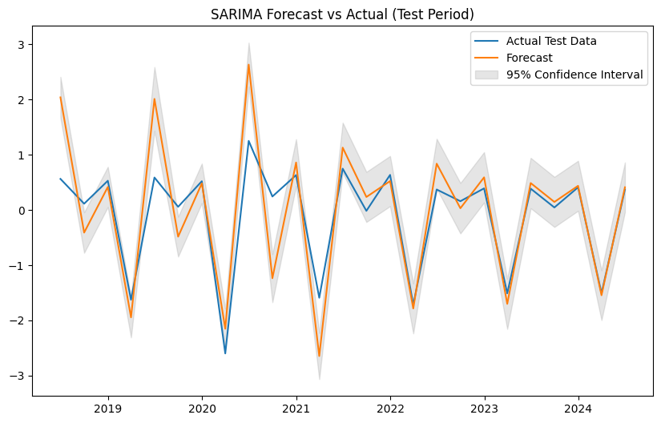

    MSE: 0.4359079273966446
    MAE: 0.44472663391466294
    RMSE: 0.6602332371190083
    MAPE: 195.47990214162468%

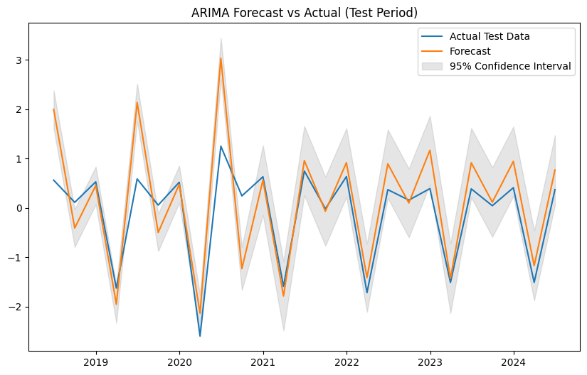

    MSE: 0.5077688728199273
    MAE: 0.5056565399935495
    RMSE: 0.7125790291749592
    MAPE: 165.73634896507465%

__DFM_MQ__


__MIDAS__
<div>
<style scoped>
    .dataframe tbody tr th:only-of-type {
        vertical-align: middle;
    }

    .dataframe tbody tr th {
        vertical-align: top;
    }

    .dataframe thead th {
        text-align: right;
    }
</style>
<table border="1" class="dataframe">
  <thead>
    <tr style="text-align: right;">
      <th></th>
      <th>Vintage</th>
      <th>RMSE</th>
    </tr>
  </thead>
  <tbody>
    <tr>
      <th>0</th>
      <td>0</td>
      <td>0.5509</td>
    </tr>
    <tr>
      <th>1</th>
      <td>1</td>
      <td>0.5745</td>
    </tr>
    <tr>
      <th>2</th>
      <td>2</td>
      <td>0.5920</td>
    </tr>
    <tr>
      <th>3</th>
      <td>3</td>
      <td>0.5945</td>
    </tr>
  </tbody>
</table>
</div>

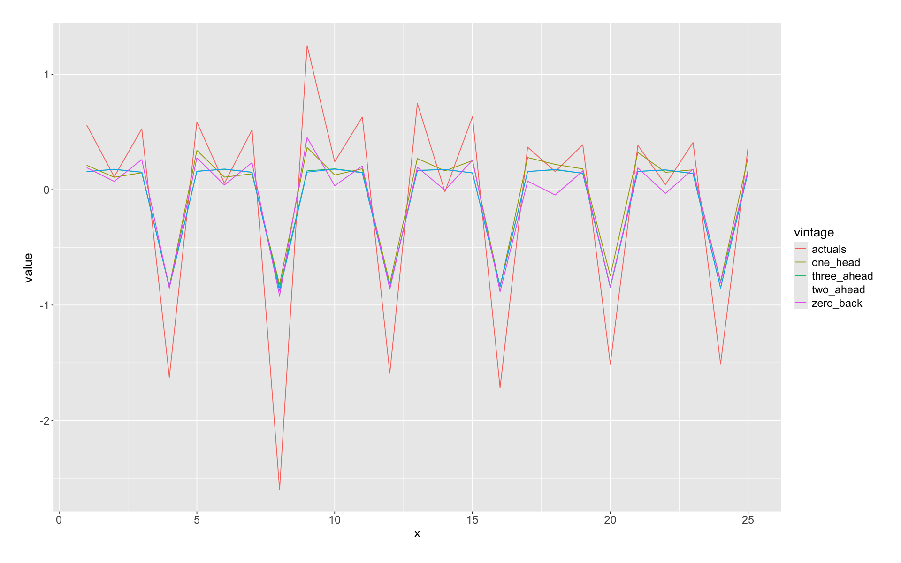

__LSTM__
<div>
<style scoped>
    .dataframe tbody tr th:only-of-type {
        vertical-align: middle;
    }

    .dataframe tbody tr th {
        vertical-align: top;
    }

    .dataframe thead th {
        text-align: right;
    }
</style>
<table border="1" class="dataframe">
  <thead>
    <tr style="text-align: right;">
      <th></th>
      <th>Vintage</th>
      <th>RMSE</th>
    </tr>
  </thead>
  <tbody>
    <tr>
      <th>0</th>
      <td>0</td>
      <td>0.5022</td>
    </tr>
    <tr>
      <th>1</th>
      <td>1</td>
      <td>0.6404</td>
    </tr>
    <tr>
      <th>2</th>
      <td>2</td>
      <td>0.8696</td>
    </tr>
    <tr>
      <th>3</th>
      <td>3</td>
      <td>0.9799</td>
    </tr>
  </tbody>
</table>
</div>

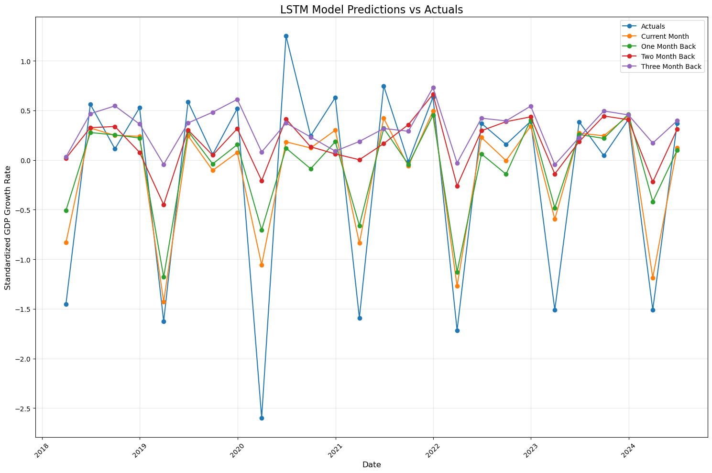

__Elastic-net__
<div>
<style scoped>
    .dataframe tbody tr th:only-of-type {
        vertical-align: middle;
    }

    .dataframe tbody tr th {
        vertical-align: top;
    }

    .dataframe thead th {
        text-align: right;
    }
</style>
<table border="1" class="dataframe">
  <thead>
    <tr style="text-align: right;">
      <th></th>
      <th>Vintage</th>
      <th>RMSE</th>
    </tr>
  </thead>
  <tbody>
    <tr>
      <th>0</th>
      <td>0</td>
      <td>0.3651</td>
    </tr>
    <tr>
      <th>1</th>
      <td>1</td>
      <td>0.3650</td>
    </tr>
    <tr>
      <th>2</th>
      <td>2</td>
      <td>0.3647</td>
    </tr>
    <tr>
      <th>3</th>
      <td>3</td>
      <td>0.4270</td>
    </tr>
  </tbody>
</table>
</div>

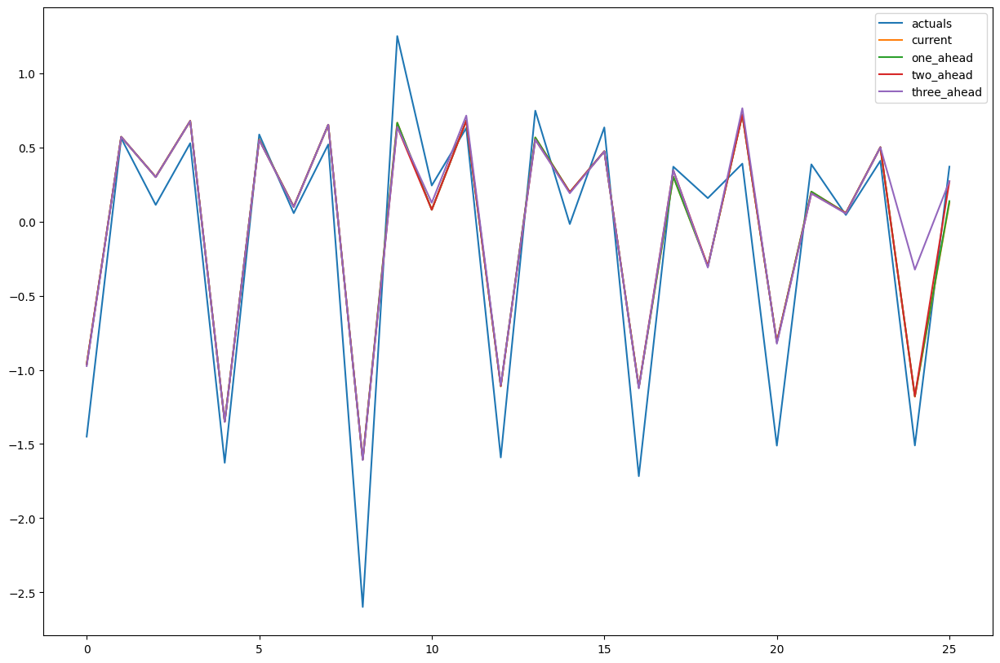

__Ensemble__
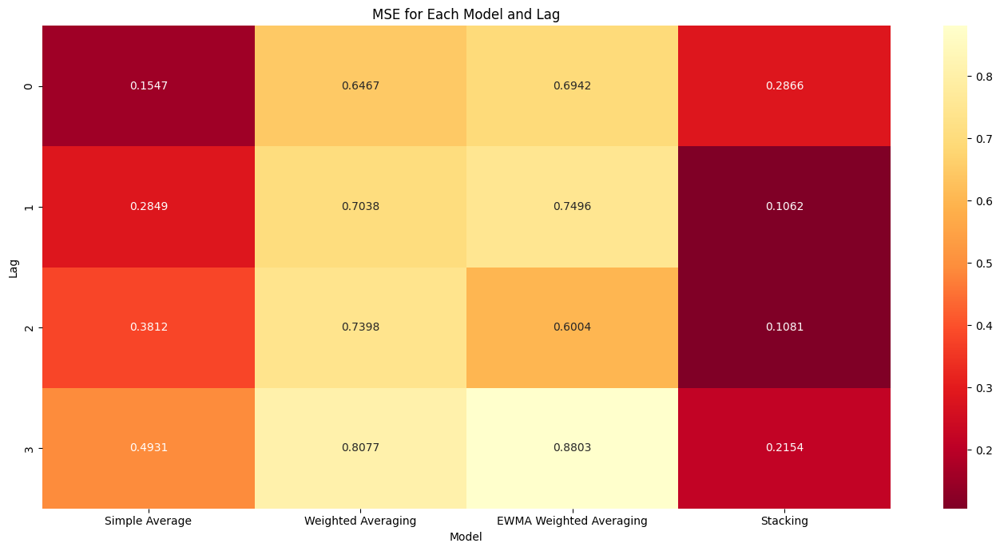
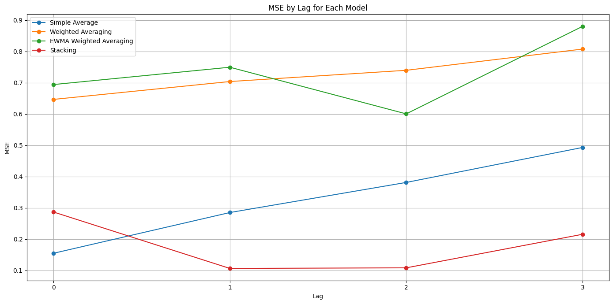
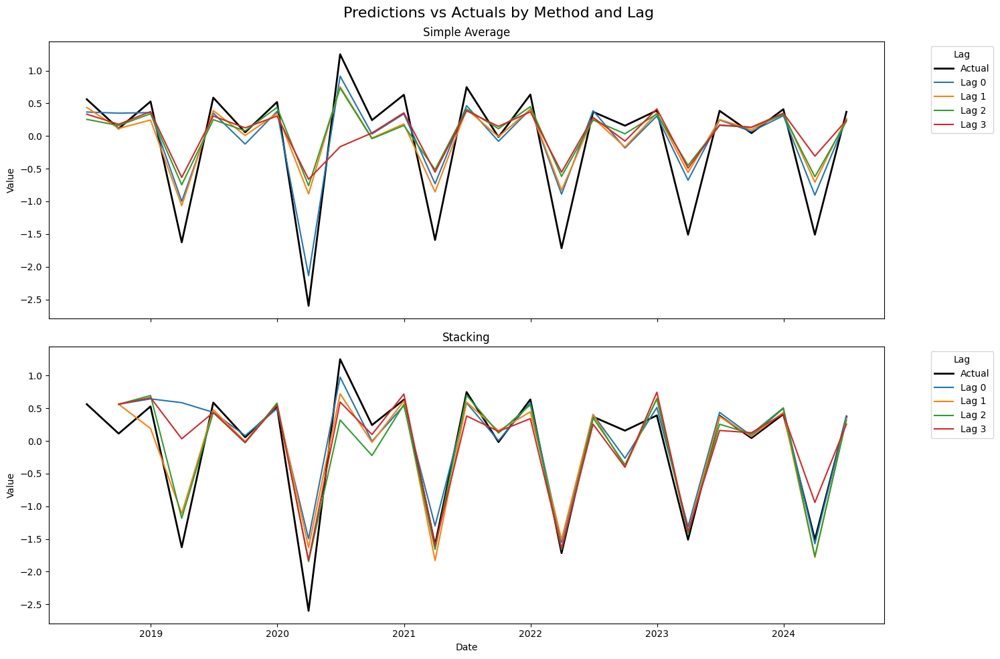


### Deseaonalized

__ARIMA/SARIMA__
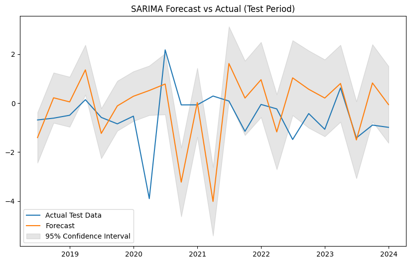

    MSE: 3.1958552579288093
    MAE: 1.3664953932955084
    RMSE: 1.7876955160006442
    MAPE: 564.1651919415204%

__ARIMA__
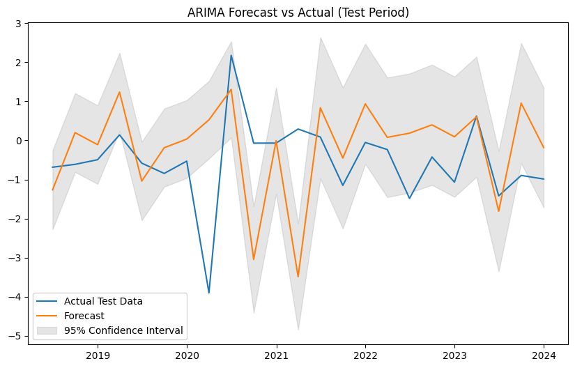

    MSE: 2.519506588103759
    MAE: 1.1362053433503874
    RMSE: 1.587295368891297
    MAPE: 471.398457926937%

__DFM_MQ__


__MIDAS__
<div>
<style scoped>
    .dataframe tbody tr th:only-of-type {
        vertical-align: middle;
    }

    .dataframe tbody tr th {
        vertical-align: top;
    }

    .dataframe thead th {
        text-align: right;
    }
</style>
<table border="1" class="dataframe">
  <thead>
    <tr style="text-align: right;">
      <th></th>
      <th>Vintage</th>
      <th>RMSE</th>
    </tr>
  </thead>
  <tbody>
    <tr>
      <th>0</th>
      <td>0</td>
      <td>1.0972</td>
    </tr>
    <tr>
      <th>1</th>
      <td>1</td>
      <td>1.1111</td>
    </tr>
    <tr>
      <th>2</th>
      <td>2</td>
      <td>1.1835</td>
    </tr>
    <tr>
      <th>3</th>
      <td>3</td>
      <td>1.1832</td>
    </tr>
  </tbody>
</table>
</div>

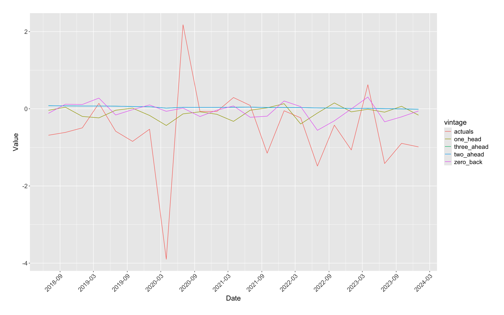


__LSTM__
<div>
<style scoped>
    .dataframe tbody tr th:only-of-type {
        vertical-align: middle;
    }

    .dataframe tbody tr th {
        vertical-align: top;
    }

    .dataframe thead th {
        text-align: right;
    }
</style>
<table border="1" class="dataframe">
  <thead>
    <tr style="text-align: right;">
      <th></th>
      <th>Vintage</th>
      <th>RMSE</th>
    </tr>
  </thead>
  <tbody>
    <tr>
      <th>0</th>
      <td>0</td>
      <td>1.2152</td>
    </tr>
    <tr>
      <th>1</th>
      <td>1</td>
      <td>1.2620</td>
    </tr>
    <tr>
      <th>2</th>
      <td>2</td>
      <td>1.2333</td>
    </tr>
    <tr>
      <th>3</th>
      <td>3</td>
      <td>1.2447</td>
    </tr>
  </tbody>
</table>
</div>

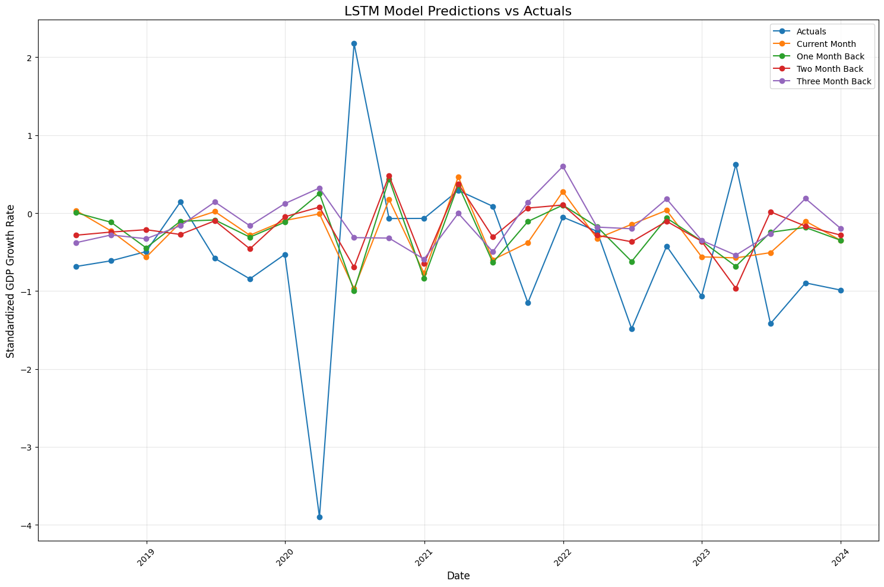


__Elastic-net__
<div>
<style scoped>
    .dataframe tbody tr th:only-of-type {
        vertical-align: middle;
    }

    .dataframe tbody tr th {
        vertical-align: top;
    }

    .dataframe thead th {
        text-align: right;
    }
</style>
<table border="1" class="dataframe">
  <thead>
    <tr style="text-align: right;">
      <th></th>
      <th>Vintage</th>
      <th>RMSE</th>
    </tr>
  </thead>
  <tbody>
    <tr>
      <th>0</th>
      <td>0</td>
      <td>0.9895</td>
    </tr>
    <tr>
      <th>1</th>
      <td>1</td>
      <td>0.9924</td>
    </tr>
    <tr>
      <th>2</th>
      <td>2</td>
      <td>1.0463</td>
    </tr>
    <tr>
      <th>3</th>
      <td>3</td>
      <td>1.0446</td>
    </tr>
  </tbody>
</table>
</div>

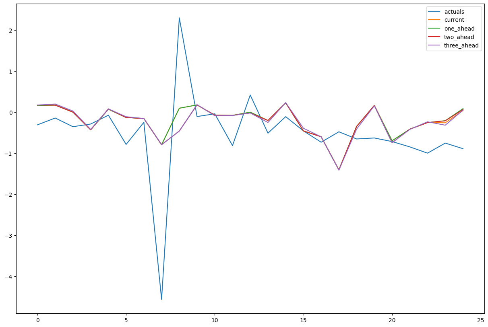

__Ensemble__
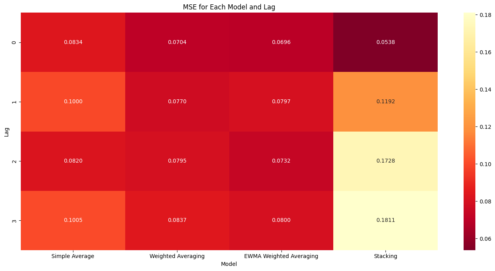
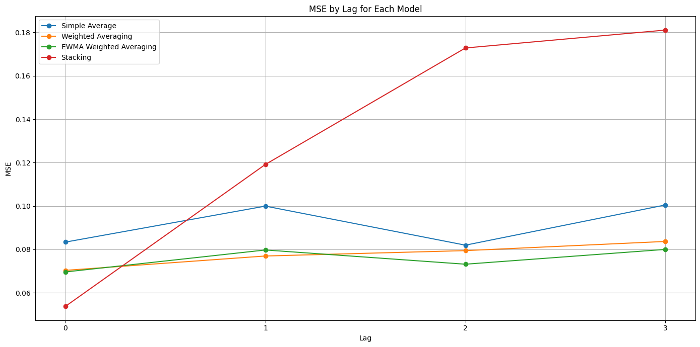
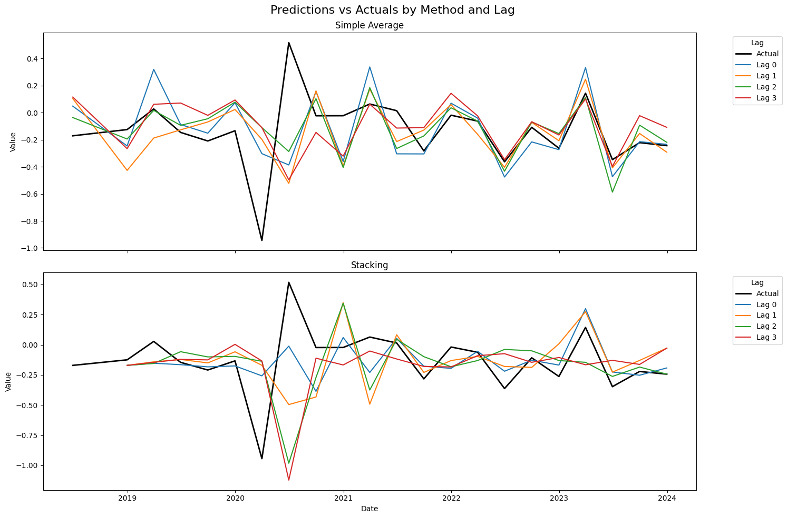

__Summary Table__
| **Method**                | **Vintage 0** | **Vintage 1** | **Vintage 2** | **Vintage 3** | **Overall RMSE** |
|---------------------------|---------------|---------------|---------------|---------------|------------------|
| ARIMA                     |               |               |               |               | 0.7126           |
| SARIMA                    |               |               |               |               | 0.6602           |
| DFM_MQ                    | 0.8331        | 0.7422        | 0.8453        | 1.0216        | 0.8610           |
| MIDAS                     | 0.5509        | 0.5745        | 0.5920        | 0.5945        | 0.5780           |
| LSTM                      | 0.5022        | 0.6404        | 0.8696        | 0.9799        | 0.7480           |
| Elastic-net               | 0.3651        | 0.3650        | 0.3647        | 0.4270        | 0.3805           |
| Ensemble                  | 0.5354        | 0.3259        | 0.3288        | 0.4641        | 0.4136           |
| ARIMA (Deseasonalized)     |               |               |               |               | 1.5873          |
| SARIMA (Deseasonalized)    |               |               |               |               | 1.7877          |
| DFM_MQ (Deseasonalized)    | 1.0509        | 1.1909        | 1.1478        | 1.2942        | 1.1710          |
| MIDAS (Deseasonalized)     | 1.0972        | 1.1111        | 1.1835        | 1.1832        | 1.1438          |
| LSTM (Deseasonalized)      | 1.2152        | 1.2620        | 1.2333        | 1.2447        | 1.2388          |
| Elastic-net (Deseasonalized)| 0.9895       | 0.9924        | 1.0463        | 1.0446        | 1.0182          |
| Ensemble (Deseasonalized)  | 0.2319        | 0.3453        | 0.4157        | 0.4256        | 0.3546          |

*Table 1: Updated Summary of RMSEs by Vintage and Method*

All models except DFM outperformed baseline before deseasonalization. This comes as a shock as before adjusting the method for generating artificial vintages with lags, DFM performed one of the best. This is potentially because DFM does not explicitly model the seasonality component of the series, while others like SARIMA/MIDAS do and ML techniques are more flexible in capturing the non-linear patterns in the data. More investigation is needed to determine how the testing vintage setup likely affects the outcome. If needed, results from DFM following the original setup is available outside the repo for comparison.

Indeed, DFM's relative performance improved after deseasonalization, making all models outperform the baseline model significantly. This illustrates the fact that the baseline ARIMA model is good at capturing seasonal pattern but fails to capture shocks as it fails to leverage relevant economic data.

Out of all the ensemble methods, simple average and stacking perform the best. The problem with weighted average and ewma average is that they overfit to training data, resulting in virtually horizontal predictions around the mean (excluded from exhibit). Instead, simple average performed well because the underlying sub-models have very different mechanisms and input variable selection, thus their simple aggregation provides much insight into the overall trend. 

As for stacking, the model is trained recursively and separately for different lags, allowing it to capture the dynamics. However, while capturing shocks, all ensemble models lagged behidn to pick up the trend. This is most evident around the COVID economic downturn and subsequent recovery. The timeliness improves after the crisis, likely because the recursive training allows the model to learn about residual dynamics. This raises the question of whether extending test data further into the past to include in training the meta model would yield better results. This is likely the case, especailly if one includes periods of unexpected macroeconomic activities, such as the 2008 financial crisis.

## Future considerations
1. Adjust and compare block structure
2. Add/ adjust data series included
3. Implement other approaches (ex. MIDASML)
4. Consider other rolling window methods
5. Extend to daily frequency
6. Inspect the deseasonalized scenario further, consider ways to enhance ability to pick up unexpected shocks
7. Consider other forms of meta model
9. Extend training and testing period
